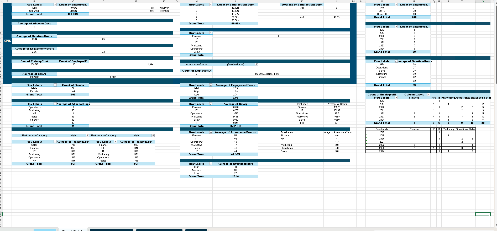
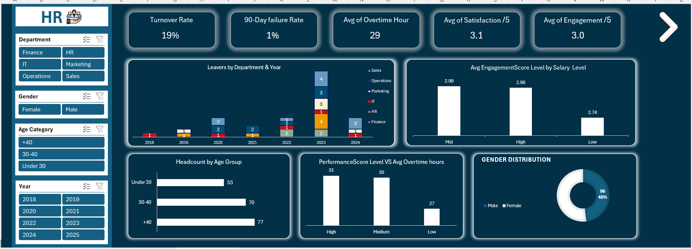
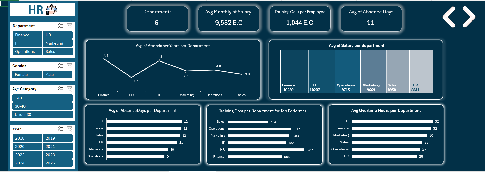
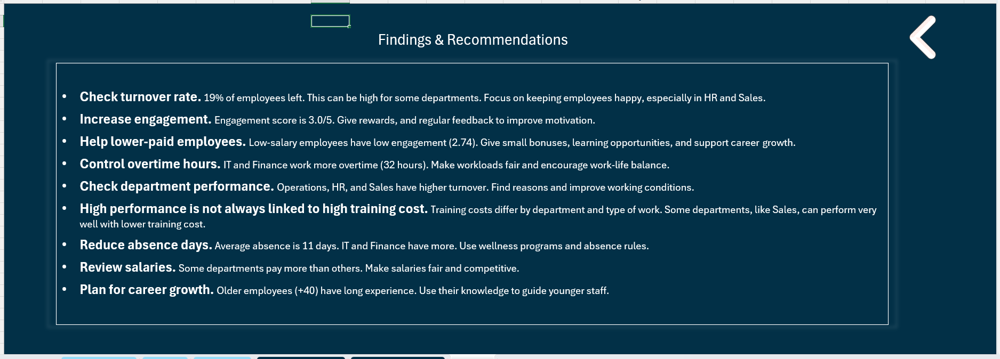
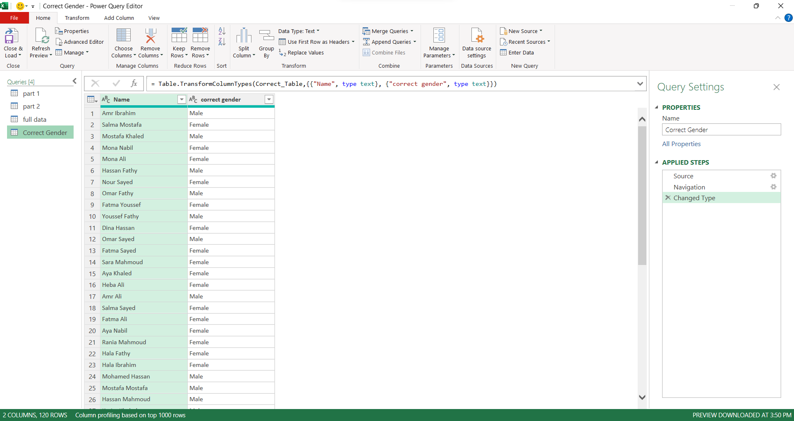

# HR Dashboard Project

## Overview

This project analyzes HR and employee data using Excel dashboards to provide insights for workforce management.  

The dashboard focuses on:

- Employee Turnover & Retention  
- Engagement & Satisfaction  
- Training & Development  
- Salary, Overtime & Absence  
- Department & Demographics Analysis  

---

## Tools Used

- Microsoft Excel
- Power Query 
- Pivot Tables  

---

## Main (Standard) KPIs

- **Turnover Rate:** 19%  
- **90-Day Failure Rate:** 1%  
- **Average Overtime Hours:** 29  
- **Average Satisfaction Score:** 3.1/5  
- **Average Engagement Score:** 3.0/5  
- **Average Monthly Salary:** 9,582 E.G  
- **Average Training Cost per Employee:** 1,044 E.G  
- **Average Absence Days:** 11  

---

## Dashboard Pages

### Pivot Table & Data Overview

### Employees Analysis

### Department Analysis

### Insights & Findings

---
## Data Cleaning & Gender Correction

During analysis, we identified **incorrect gender values** in the original dataset.  

- A new table, **Correct Gender**, was created with accurate gender information.  
- This table was then **appended** to the main dataset, **Full Data**, to create a corrected, unified dataset.  
- This ensured **accurate gender information** for all employees, improving analysis for **gender distribution** and related KPIs.  

---

## Key Insights

- HR and Sales have higher turnover than other departments.  
- Engagement and satisfaction are lower for low-salary employees.  
- High-performing employees do not always require higher training cost. Example: Sales perform well with lower training cost.  
- IT and Finance departments have higher overtime and absence rates.  
- Older employees (+40) hold critical experience and can mentor younger staff.  
- Average salary differs between departments; some departments may need adjustment.  

---

## Recommendations

- Reduce turnover with engagement programs and employee retention strategies.  
- Focus training on employees who need improvement, not only high performers.  
- Improve satisfaction and engagement through rewards, mentorship, and career development.  
- Balance overtime and workload to prevent burnout.  

---

## Dataset

This project uses employee and department-level datasets. Excel and Pivot Tables were used for data analysis and dashboard creation.  

Sample datasets and screenshots are included in this repository for reference.
